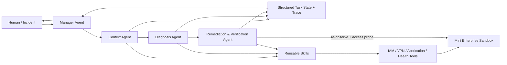

# OfficeOps Agent

**面向企业数字办公环境的、验证优先的 IT 运维多 Agent 原型。**

OfficeOps 把“员工打不开企业 SaaS”从关键词触发脚本，改造成一条有证据、能执行、会复验、失败不误关单的闭环：**Diagnose → Act → Verify**。

当前是 GOAI Agent Infra 新智基座赛道的初赛最小版本，只聚焦 Alice 的 Docs 账号锁定场景。确定性 Local Orchestrator 用于回归业务层与失败分支；官方 AgentTeams v1.2.2 则已实际部署 Manager、3 个 Worker、Matrix、MinIO 与 Higress，并通过角色隔离的 MCP 服务跑通同一条真实协作链路。

## Problem

“我突然打不开公司 Docs 了”可能来自账号锁定、身份停用、VPN 关闭、权限丢失、服务异常或未知策略。只按工单关键词执行 `unlock_account()` 可能修错；只看接口 `success=true` 又可能制造假恢复。

OfficeOps 同时读取 Identity、VPN、Permission、Service Health 与功能访问证据，先诊断再执行，并在执行后重新观察真实状态。

## Why Multi-Agent

| Agent | 职责 | 权限边界 |
|---|---|---|
| Manager | 任务拆解、状态、重试、汇总 | 不直接调用企业写操作 |
| Context | 采集 IAM/VPN/权限/健康/访问证据 | 只读 |
| Diagnosis | 从结构化证据判断根因 | 只读，不执行 |
| Remediation & Verification | 解锁、重读状态、功能探测 | 仅策略允许的 MEDIUM 动作 |

这些不是四个名字包装一个函数：它们有独立输入输出、Skill、Tool 权限和失败策略，完整清单见 [Agent Identity](docs/AGENT_IDENTITIES.md)。

## Demo

默认状态：`docs=healthy`、`vpn.enabled=true`、`docs permission exists`、`alice.locked=true`。

```powershell
python -m pip install -e ".[dev]"
$env:PYTHONIOENCODING="utf-8"
python -m app.cli --task-id demo-account-lock
```

实际期望结果：`COMPLETED`、`root_cause=account_locked`、`attempts=1`。Sandbox 中 `alice.locked` 从 `true` 真实变为 `false`，随后 IAM 重读和 Docs access probe 都通过。

运行 Fake Success：

```powershell
python -m app.cli --fake-success --task-id demo-fake-success
```

该命令预期以退出码 `1` 结束：Tool 两次返回成功，但账号状态没有变化；系统经过一次 `RETRYING` 后输出 `FAILED`，不关闭事件。

## Architecture



业务层依赖 `AgentRuntime` 协调端口。`LocalAgentRuntime` 提供快速、确定性的同进程回归；AgentTeams 运行时通过 Matrix 消息、可分发 Skill 和 MCP Tool 执行真实多容器协作。两条路径复用同一领域模型、Sandbox、风险策略和验证语义。

## Agents

身份代码位于 `app/agents/identities.py`；执行入口位于 `app/agents/workers.py`。Manager 维护以下状态流：

```text
RECEIVED → COLLECTING_CONTEXT → DIAGNOSING → EXECUTING → VERIFYING → COMPLETED
                                                        ↘ RETRYING → EXECUTING
                                                        ↘ FAILED
```

## AgentTeams

项目以官方最新稳定版 **v1.2.2** 为核对基线：

- `agentteams/officeops-workers.yaml`：1 个 `Manager` + 3 个 standalone `Worker`；
- `agentteams/adapter.py`：版本化 assignment envelope 与共享状态引用；
- `agentteams/skills/`：四个可分发 Skill；
- `agentteams/UPSTREAM.md`：官方源码的版本、commit、许可证和本地 checkout 记录；
- `docs/AGENTTEAMS_MAPPING.md`：Task/Context/Message/State/Result 的完整映射。

官方 AgentTeams v1.2.2 源码已拉取到独立路径 `E:\code\AgentTeams-upstream`，固定 commit `849182af8e017168a5a200a87b1062142caf462d`。当前机器已运行 Controller、Manager、3 个 Worker、Matrix、MinIO 与 Higress；四个 OfficeOps Skill 已同步到对应 Worker。Context Worker 只看到 5 个只读 MCP Tool，Remediation Worker 只看到解锁与两项复验 Tool。

启动本地 Sandbox 与两组角色隔离 MCP 服务，然后发送一张真实 Matrix 工单：

```powershell
.\scripts\start_agentteams_tools.ps1
.\scripts\sync_agentteams_manager_policy.ps1
python scripts\run_agentteams_demo.py --timeout 600
```

脚本会先重置沙箱，再等待三位 Worker 依次返回，最终审计 Worker 证据、先后顺序和恢复状态。已通过的运行证据位于 `artifacts/agentteams/agentteams-account-lock-20260815-074611/`。AgentTeams 管理界面为 `http://127.0.0.1:18088`；本机管理员凭据保存在安装器生成的环境文件中，不写入仓库。

## Skills

| Skill | 输入 → 输出 | 风险 |
|---|---|---:|
| EmployeeContextSkill | StructuredIncident → EmployeeContext | LOW |
| AccessDiagnosisSkill | EmployeeContext → DiagnosisResult | LOW |
| AccountRemediationSkill | Diagnosis → ExecutionRecord | MEDIUM |
| AccessVerificationSkill | user + app → VerificationResult | LOW |

每个 Skill 都定义 name、description、input/output schema、pre/postconditions、risk、dependencies 和 failure handling，详见 [Skill 清单](docs/SKILLS.md)。

## Verification Loop

OfficeOps 的完成条件不是 `unlock_account.success == true`，而是：

```text
fresh IAM read: locked == false
AND
fresh functional probe: apps/docs/access/alice.accessible == true
```

故障注入让 Tool 伪报成功但不改状态，专门验证这条边界。

## Enterprise Sandbox

启动 FastAPI 服务（默认监听 `0.0.0.0:18100`）：

```powershell
python -m sandbox.api
```

接口：

- `GET /users/{user}`
- `GET /users/{user}/permissions`
- `POST /users/{user}/unlock`
- `GET /vpn/{user}`
- `GET /apps/{app}/health`
- `GET /apps/{app}/access/{user}`
- `POST /admin/faults/fake-success`

Demo 默认走同一个有状态 Sandbox 的 InMemory Client；`HttpSandboxClient` 提供等价 HTTP 适配，证明 Tool 与底层部署解耦。

## Observability

每次任务写入 `artifacts/runs/{task_id}/`：

```text
input.json
context.json
diagnosis.json
tool_calls.jsonl
verification.json
trace.json
result.json
task_state.json
```

Trace 覆盖 Agent、Skill、Tool、状态迁移、执行、验证和重试，并统一携带 `task_id` 与 `trace_id`。

## Tests

```powershell
python -m pytest -q
```

当前实跑结果：`13 passed`。覆盖要求的 `test_account_locked`、`test_permission_ok`、`test_docs_healthy`、`test_successful_unlock`、`test_verification_after_unlock`、`test_fake_success_detection`、`test_unknown_root_cause`，以及 API 状态变化、reset、MCP 角色权限和 artifact 完整性。

一次运行正常场景、Fake Success 和全部测试：

```powershell
.\scripts\run_preliminary_demo.ps1
```

## Competition Mapping

- [初赛要求逐项映射](competition/preliminary/COMPETITION_MAPPING.md)
- [500 字以内作品简介](competition/preliminary/作品简介.md)
- [12 页 PPT 文案](competition/preliminary/PPT_CONTENT.md)
- [AgentTeams 映射](docs/AGENTTEAMS_MAPPING.md)
- [官方工具链选型与真实状态](docs/OFFICIAL_TOOLCHAIN_MAPPING.md)
- [安全边界](docs/SECURITY.md)

## Open / Reuse Value

项目采用 Apache-2.0。领域 Schema、4 个 Skill、Tool 协议、Fake Success 注入、验证状态机和 artifact 规范均可独立复用。接入 Wiki、Jira、GitLab、CRM、OA、SSO 或 VPN 时，应增加 Tool Adapter 与场景诊断规则，而不是复制整条 Agent 流程。

初赛不加入 RAG 或 Agent Memory；比赛要求的上下文增强以 **Shared State + Trace Observability** 两项真实能力满足。

## Roadmap

1. 将当前角色隔离 MCP 从直连 SSE 迁入 Higress Consumer，统一鉴权、限流和审计；
2. 拆分 Verification Agent，加入 High/Critical Human Approval；
3. 增加 VPN、权限、服务异常与补偿/升级路径；
4. 对接 AgentScope Studio、AgentLoop 或 LoongSuite；
5. 建立诊断准确率、闭环率、误执行率、恢复步数与成本评测。
