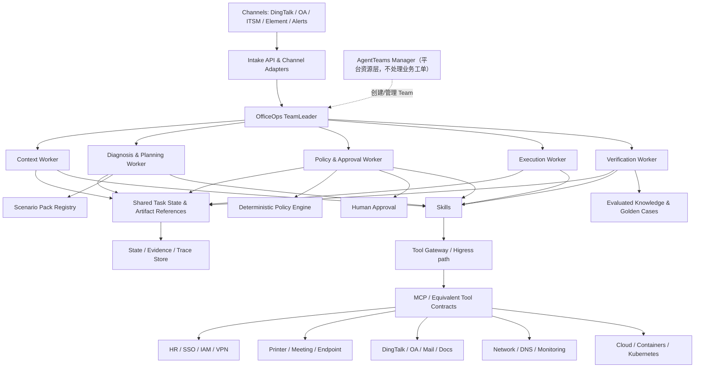

# 08 · System Design（系统设计）

## 总体架构



## 三层扩展模型

| 层 | 稳定内容 | 新场景如何扩展 |
| --- | --- | --- |
| OfficeOps Core | WorkItem、状态机、Agent Identity、Approval、Execution、Verification、Evidence | 通常不修改；只按版本演进通用 Schema |
| Scenario Pack | 专业字段、Context Requirements、Diagnosis/Plan、Policy、DesiredOutcome、Golden Cases | 添加 `saas-access`、`printer-incident`、`vpn-request` 等包 |
| Tool Adapter | 厂商 API、CLI、RPA、凭据、错误码和字段映射 | 添加 Printer/VPN/DingTalk/Cloud/K8s Adapter |

这就是“先设计通用架构”的具体落点：先固定替换边界和不变量，而不是预先写完所有厂商功能。

## AgentTeams 映射

| OfficeOps 角色 | AgentTeams 能力映射 | 状态/交接 |
| --- | --- | --- |
| AgentTeams Manager | Manager（平台层） | Agent/Team/Human 资源生命周期与跨团队协调；只与 Team Leader 通信，不处理业务工单 |
| OfficeOps TeamLeader（业务编排） | Team Leader（Team 内专用 Worker） | 接收工单、拆解、@Worker 委派、状态迁移、超时/重试、验收与汇总 |
| Context 等职能 Agent | standalone Worker；规模扩大后可组成 Team | 接收版本化 Envelope，输出结构化 Artifact |
| Agent 间消息 | Matrix 房间/消息 | 短 JSON 可内联；大对象传 ArtifactRef + hash |
| 共享文件/Artifact | AgentTeams 支持的共享存储能力或外部对象存储 | 保存 Context、Plan、Evidence、Report |
| Skill | AgentTeams 可分发 Skill | 记录名称、版本、Owner 和评测状态 |
| Human | Human/渠道审批参与者 | 决定由真实身份签名，不由 Agent 冒充 |

### 当前原型与目标架构

| 能力 | 当前队友原型 | 目标补齐 |
| --- | --- | --- |
| 拓扑 | Manager 直连 3 Worker（官方基础拓扑） | 迁移到 Team + TeamLeader，AgentTeams Manager 退居平台资源层；按需拆 Policy 与独立 Verification |
| 通信 | Matrix 真实交接 | 引入统一 Envelope 与 ArtifactRef |
| Skill | 4 个 Docs 访问 Skill | 纳入 `saas-access-incident` Scenario Pack |
| MCP | 只读与修复两组角色隔离 Tool | 经 Tool Gateway 统一策略、鉴权、限流和审计 |
| 状态 | Matrix transcript + 本地 TaskState | 统一 WorkflowRun 事件和乐观锁 |
| 验证 | 同一修复 Worker 使用新鲜查询/探针 | 独立只读 Verification Worker |
| 审批 | 风险门禁设计，未完成真实 Human Approval | L2/L3 交互和签名记录 |

AgentTeams 具体版本在复赛开发前固定并记录上游 commit；业务仓库只保存 OfficeOps 配置、Skill、Adapter 和契约，不复制或冒充上游源码。

### 相对官方最小 Demo 的深化点

官方 Demo 是协作机制的最小样例；OfficeOps 建立在其上补齐领域工程，不重做 runtime：

- 输入：自由文本报障，规范化与初筛由系统完成——官方 Demo 输入自带 `scenario_id`，等于提前泄露故障类别；
- 取证：按证据缺口的多源采集与补充取证回调，而非固定顺序流水线；
- 门禁：确定性 Policy Engine + Tool Gateway 二次校验，风险不靠 Prompt 约束；
- 验证：独立只读验证与功能探针——官方 Demo 的 Executor 与 Verifier 合并，且执行过任意动作后 Mock 即返回恢复指标；
- 状态：按 Run 隔离，重开创建新 Run 引用旧证据；
- 评测：Golden Cases + 同症异因 + 变体分桶 + Fake Success 注入。

## 核心组件

### 1. Intake & Channel Adapter

- 接收钉钉/OA/ITSM/Element/告警；
- 保存原始不可变输入；
- 解析渠道身份和外部记录引用；
- 把追问、审批、通知映射回原渠道；
- 渠道不可用时进入 Outbox 重试，不丢业务终态。

### 2. Workflow & State

- `WorkflowRun` 使用事件化状态迁移和乐观锁；
- 每个 Task 有 assigned agent、输入/输出 Artifact、attempt 和 deadline；
- Manager 无法跳过 Policy/Approval/Verification Gate；
- 重开任务创建新 Run，并引用旧 Run 证据。

### 3. Scenario Pack Registry

```text
scenario-pack/
├── manifest            # id/version/owner/status
├── input-schema
├── object-schemas
├── context-requirements
├── skills
├── routing-policy
├── risk-policy
├── verification-spec
├── golden-cases
└── knowledge-metadata
```

Registry 初期可用仓库和版本文件；当包和团队数量增长后再接入 Nacos 等治理能力。

### 4. Policy & Tool Gateway

双层门禁：Policy Agent 生成 PolicyDecision；Tool Gateway 在调用时再次校验 Agent Role、Tool allowlist、ActionStep、risk、plan_hash、Approval、幂等键和时效。即使 Prompt 或 Manager 出错，Gateway 也不能放过越权写入。

### 5. Evidence & Trace

- Evidence 保存业务事实和不可变内容引用；
- Trace 保存 Agent/Skill/Tool/状态/耗时/错误和成本；
- 所有记录统一 `run_id/task_id/trace_id`；
- Evidence 内容按敏感等级访问，Trace 默认只存脱敏摘要和哈希；
- Demo 提供可直接查看的时间线和结果报告。

## 上下文能力选择

比赛要求的四项能力中，MVP 优先实现：

1. **Shared State**：版本化 WorkflowRun、Context/Plan/Execution/Verification Artifact；
2. **Trace Observability**：Agent、Skill、Tool 和状态的全链路事件。

RAG 在 OfficeOps 中被限定为 **EvaluatedKnowledge 管道**：只有通过评测和人工评审的 ExperienceCandidate、SOP 与已验证案例才进入检索库；输出必须带引用并标注适用范围，不参与审批门禁。这条管道比通用 RAG 窄，但保证未经验证的知识不会影响处置决策。长期 Memory 同样只保存评审通过的内容。即使暂不实现检索，Shared State + Trace 已满足至少两项上下文能力。

## 数据与存储

| 数据 | MVP | 可生产演进 | 说明 |
| --- | --- | --- | --- |
| Workflow/Artifact metadata | JSON/JSONL 或 PostgreSQL Repository | PolarDB/PostgreSQL | 领域层依赖 Repository 接口，不绑定部署形态 |
| Evidence 原文 | 本地受控目录/对象存储 | MinIO/企业对象存储 | 数据分级、哈希和留存策略 |
| Trace | JSON/JSONL | OpenTelemetry + LoongSuite/AgentScope Studio/AgentLoop 路线 | 复用 trace_id 语义 |
| Knowledge/RAG | 可不实现 | PostgreSQL/向量存储或企业知识库 | 只存已评审知识和引用元数据 |
| Policy/Scenario Pack | Git 版本化 | Git + Nacos/配置治理 | 先少而清晰，规模增长再引入中心 |

## 推荐工具链取舍

| 组件 | 决策 | 何时需要 |
| --- | --- | --- |
| AgentTeams | 必选协同基点 | 初赛设计和复赛运行均必须 |
| 阿里云 Skills | 可评估分发部分通用/云 Skill | 有明确云场景和鉴权方案时 |
| Higress | Tool/模型统一入口候选 | 需要 Consumer 鉴权、路由、限流和审计时 |
| Nacos | 场景包、Skill、Prompt、Tool 配置治理候选 | 版本/团队/环境增多时 |
| PolarDB PostgreSQL | 状态、Evidence、RAG 存储候选 | 从本地证据走向并发和长期保留时 |
| UnifiedModel | 跨系统对象和关系模型候选 | 需要统一查询大量异构对象时 |
| RocketMQ | 事件驱动、长任务和通知候选 | 批量、异步、可靠重试需求出现时 |
| 官方可观测方案 | Trace/Eval 后端候选 | 复赛需要在线观测和量化评测时 |

不以接入数量宣称成熟度。每个组件必须说明必要性、接口、权限、可替换性和迁移成本。

## 可靠性设计

- 状态迁移使用版本号防止并发覆盖；
- ToolCall 使用幂等键；写超时先 read-after-unknown；
- Task/通知采用有界重试和死信/人工队列；
- Artifact 内容寻址和哈希校验，防止引用内容被替换；
- Scenario Pack/Skill/Tool Adapter 均记录版本，可按 Run 回放；
- LLM 不可用时，结构化输入和确定性场景可走降级流程；
- Policy/Evidence/Gateway 不可用时写操作 fail closed。

## 未来代码目录映射

```text
officeops/
├── domain/             # 通用实体、不变量、状态机
├── orchestration/      # AgentTeams adapter、Manager、Task/Envelope
├── agents/             # Agent Identity 与 Worker 实现
├── skills/core/        # 核心 Skill
├── scenarios/          # saas-access、printer、vpn-request 等场景包
├── tools/contracts/    # MCP/等价 Tool Schema
├── adapters/           # 厂商/Sandbox Adapter
├── policy/             # 确定性规则和审批门禁
├── observability/      # Evidence、Trace、Report
├── api/                # Channel/API/UI
├── tests/              # unit/contract/scenario/evaluation
└── examples/           # 样例输入输出和证据
```

当前不新增这些空目录；进入复赛开发并确定实现边界后按模块创建，避免目录先于代码。

## 新场景接入步骤

1. 定义 WorkItem 和 ManagedObject subtype Schema；
2. 定义 Context Requirements 和权威数据源；
3. 实现/复用 Scenario Skill；
4. 定义风险、审批和 DesiredOutcome；
5. 选择现有 Tool Capability，缺失时增加 Adapter；
6. 编写正常、异常、Fake Success 和越权 Golden Cases；
7. 注册 Scenario Pack 并灰度发布；
8. 不修改 Manager/Workflow Core，除非发现真正通用的新不变量。

## 相关文档

- 上游：[03 领域模型](03-domain-model.md) · [07 Tool 契约](07-tool-mcp-contract.md)
- 下游：[09 安全设计](09-security-design.md) · [10 评估计划](10-evaluation-plan.md)
